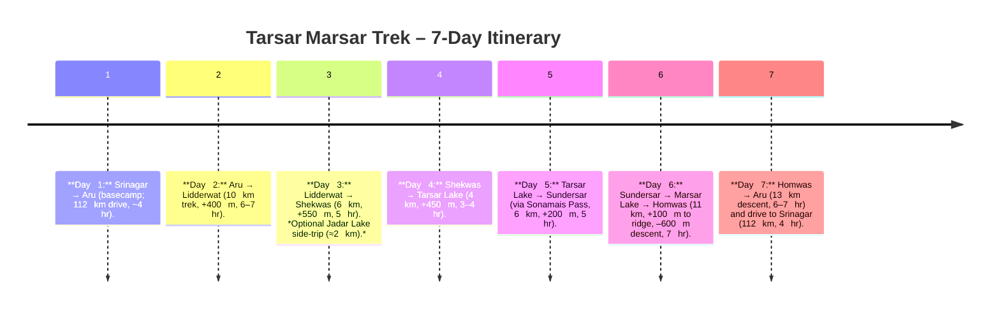

# Executive Summary

The **Tarsar Marsar Trek** in Kashmir (Aru/Pahalgam region) is a **7-day moderate alpine trek** covering ~50–60 km through lush meadows, pine forests, and three high-altitude lakes (Tarsar, Sundersar, Marsar). Starting at Aru Valley (basecamp, 2,400 m), the route climbs gradually via Lidderwat and Shekwas to Tarsar Lake (3,800 m), then traverses a ridge to Sundersar, descends to Marsar Lake (3,945 m), and returns via Homwas to Aru. The highest point is the Marsar (Sonamarg) Ridge (~4,100 m).  The trek is best attempted **June–September** when meadows bloom and snowmelt fills the lakes. Temperatures range roughly 12–20 °C by day and drop near 0–5 °C at night; July–August days average ~15–18 °C. 

**Key highlights:** Tarsar (“Turquoise Lake”) and Marsar (mist-shrouded) twin alpine lakes, expansive wildflower meadows, dense pine and birch forests, and panoramic Kashmir Himalaya vistas. Trekkers often meet nomadic Gujjar–Bakarwal shepherds grazing flocks en route. The lakes carry rich folklore – Tarsar and Marsar are said to be **“twin sisters”** in Kashmiri legend, even celebrated in a 16th‑century poet‑king’s verse. 

**Logistics:** Fly into Srinagar and drive 100–120 km via Pahalgam to Aru (approx. 3–4 hr). Aru village (34.0908° N, 75.2633° E) is the trek base. Hire guides, horses/porters locally (typical 4–6 people per guide; horses ~₹1000–1500/day each). Trek packages (~₹14,000–16,000) normally include meals, camping gear, permits and shared transport. Mobile network dies after Aru (carry power banks). 

**Safety:** Altitude gain is moderate (summit ~4,100 m); acclimatization (day 3 at Shekwas, 3,350 m) is built in. Walk steadily to avoid AMS, hydrate and wear layers. Route crossings: the trail fords the Lidder River via bridge at Lidderwat (day 2) and smaller streams on day 3. Weather can be unpredictable – pack warm rainproof gear.  

Below is a detailed report covering itinerary, waypoints, weather, ecology, cultural context, logistics, and safety, with sources cited. A comparison table of trek operators is included at the end.

## Route Itinerary (Day‑by‑Day)

- **Day 1 (Drive to Aru):** Pick up at Srinagar (12 pm), drive via Pampore, Awantipora, Pahalgam to Aru Valley. Aru (2,400 m) is a small village in pine meadows. Prepare gear, rest.  
- **Day 2 (Aru → Lidderwat):** Trek ~10 km to Lidderwat (2,800 m). The trail ascends through forested ridges then descends to the Lidder River valley. You cross the Lidder stream on a bridge en route. Camp near streams/springs in Lidderwat.  
- **Day 3 (Lidderwat → Shekwas):** Hike ~6 km, gaining to ~3,350 m. Initial gentle climb through forest and meadows; optional 2 km detour to *Jadar Lake* (a beautiful small tarn). Eventually reach the Shekwas (Sekhwas) valley – a meadow campsite. This is a key acclimatization day.  
- **Day 4 (Shekwas → Tarsar Lake):** Short (4 km) but steep ascent to Tarsar Lake (3,800 m). Trek through subalpine meadows up to the lake basin. Camp on the lake shore. *Tarsar Lake* (34.14056° N, 75.14833° E) is an emerald alpine lake. Spend afternoon walking around it.  
- **Day 5 (Tarsar → Sundersar):** Continue ~6 km to *Sundersar* Lake (4,000 m) via *Sonamais Pass* (12,960 ft / 3,950 m). Gain a short ridge (~200 m) with panoramic views, then descend into the next valley. Camp at Sundersar, another high alpine lake.  
- **Day 6 (Sundersar → Marsar → Homwas):** Early start – a 11 km day. Climb to Marsar Ridge (4,100 m) then descend to Homwas (3,500 m). Halfway, visit *Marsar Lake* (12,946 ft / ~3,945 m, 34.14389° N, 75.11000° E) via a spur from the ridge. Marsar (often cloud-hidden) has mirror-like waters. Return to the main trail and descend to Homwas campsite. Homwas has tents and streams.  
- **Day 7 (Homwas → Aru → Srinagar):** Descend 13 km to Aru (2,400 m) – about 6–7 hr. Drive back to Srinagar (112 km, ~4 hr) arriving by evening. 

 *Tarsar Lake (foreground) and alpine peaks in summer. Camp at lake’s edge for sunrise views.*

## Key Waypoints & Coordinates

- **Aru Valley (Basecamp):** 34.0908° N, 75.2633° E; elevation ~2,400 m. Gateway to Lidderwat/Tarsar treks.  
- **Lidderwat:** ≈34.06° N, 75.24° E; ~2,800 m. Trekkers’ base mid-route. Fresh springs and meadows.  
- **Shekwas (Sekhwas):** ≈34.07° N, 75.24° E; ~3,350 m. Alpine meadow  valley en route to Tarsar.  
- **Tarsar Lake:** 34.1406° N, 75.1483° E; elevation 3,795 m. Large emerald alpine lake.  
- **Sundersar (Sunder Sar):** ~34.144° N, 75.138° E; 4,000 m. Twin lakes adjacent to Tarsar (to the west), reached via pass.  
- **Marsar Lake:** 34.1439° N, 75.1100° E; elevation ~3,945 m. Alpine lake west of Tarsar.  
- **Homwas:** ~34.13° N, 75.10° E; 3,500 m. Meadow camping ground north of Marsar, en route out.  

*(Coordinates approximate; Aru and lake coords from Wikipedia.)*

## Maps & Route Diagrams

Below is a regional map highlighting Srinagar↔Aru access. A more detailed topographic map of the trek route should be consulted (maps available via Google or trekking guides). 

 *Route overview: Srinagar to Aru (base) and onward to Sonamarg (alternate exit). Distances shown are road travel.* 

## Seasonality & Weather

- **Best Season:** **June–September**. Snow clears by mid-June (though early season may have patches). Wildflowers peak July–August. 
- **Weather:** Summer days at 2,500–4,000 m typically 12–20 °C, nights near 0–5 °C. **Monsoon:** Kashmir sees some monsoon (July–Aug) rain, though less than the plains. Afternoon showers or fog can occur. Treknomads notes July–August highs ~15–18 °C, nights around 0 to –3 °C. September days ~15–19 °C, nights ~10–12 °C. 
- **Cold & Snow:** Snowstorms can occasionally occur even in July at high passes. Early June or late Sept can have snow. 
- **Weather Tips:** Pack wind/rain protection. Temperature swings are large (clear nights freeze). 

## Flora and Fauna

The trek traverses diverse Himalayan ecosystems:

- **Forests:** Lower slopes (Aru–Lidderwat) have pine, spruce, birch.  
- **Alpine Meadows:** July–Aug bloom with *geum*, blue poppy, *potentilla*, gentian, *Hedysarum* (wild peas), primula and many wildflowers.  
- **Fauna:** Possible sightings include Himalayan marmot (ground squirrel), ibex on cliffs, musk deer, Himalayan brown bear (rarely), and Kashmir stag (hangul) in higher areas. Birdlife: bar-headed geese, lammergeyer (bearded vulture), alpine choughs, golden eagles, black bulbuls, cinnamon sparrows around lakes. Treknomads also mentions Himalayan serow, musk deer and snow leopard in the region.  
- **Cultural Ecology:** In summer, Gujjar and Bakarwal nomadic shepherds bring herds of sheep/goats; you will pass seasonal *pats* (summer settlements) of these shepherds. 

## Cultural Context

Local lore holds **Tarsar and Marsar as “twin sister” lakes**. Kashmiri folklore and poetry celebrate the lakes: 16th-century ruler Yusuf Shah Chak wrote of a lover’s “tears…flow from my eyes like streams from Tarsar and Marsar”. A myth speaks of two sisters where Tarsar is visible and Marsar is mystically hidden under mist. The trek also passes through ancient grazing lands of the Gujjar–Bakarwal community – camels, sheep and horses may be seen with nomads in the meadows. 

## Permits and Regulations

- **Forest Permit:** Treks enter Dachigam National Park regions; forest entry permits are typically required (often included in organized trips). Always check with local authorities or trek operators for up-to-date permit rules.  
- **Leave No Trace:** The area is ecologically sensitive (part of Dachigam NP); carry out all trash, use biodegradable soaps, and avoid contaminating water.  
- **Local Rules:** Carry ID and registration copies (Kashmir requires checking IDs in transit). Drone usage is banned in Jammu & Kashmir.  

## Safety and Medical Considerations

- **Altitude:** Climb is gradual, but max ~4,100 m. Altitude sickness is possible. Drink water, eat carbs, and acclimatize. If symptoms (headache, nausea) occur, descend or rest. Many trekkers take the built-in rest (Day 3) to acclimatize at 3,350 m.  
- **River Crossings:** The main crossing is the Lidder River at Lidderwat (via bridge). Use caution on wet rocks. Streams near Tarsar are usually shallow but use caution on slippery stones.  
- **Weather Risks:** Rain/snow can make trails slippery. Sun exposure is high at altitude (pack sunscreen, hat).  
- **Wildlife:** Bears/musk deer are shy; no need for bear spray typically, but store food securely.  
- **Health:** Carry a basic first-aid kit and altitude meds (if prone). Burns from the sun and blisters are common – bring good sunscreen and blister care.  
- **Guides:** Hiring a certified local guide greatly enhances safety (they know the terrain, weather patterns, emergency protocols). Porter or mule support helps avoid strain/injury. 

## Gear and Packing List

Essential gear includes sturdy **trekking boots** with good ankle support; a warm **down jacket** and fleece layers; waterproof jacket/pants; wool socks; sunhat; gloves; and a 50–60 L backpack. Don’t skimp on a quality sleeping bag (rated to –5 °C or lower) as nights are cold. Also pack a water purifier or tablets (natural streams are safe when boiled/treated). Carry trekking poles (for knees on descents and river crossings) and a rain cover for pack. Bring **dual-use power banks** as there’s no electricity or mobile signal past Aru. A small personal tent is optional if not using a guided group’s tent. 

👉 *Packing Tip:* Lightweight but warm – layers win. Ponchos or rain jackets are crucial during July–Sept rains.

## Logistics and Access

- **Srinagar Hub:** Fly to Srinagar (SXR). From the airport or city, private cabs or shuttle (shared tempo travelers) can be hired to Aru Valley. Shared taxi (1400–2000 INR per cab) is common.  
- **Srinagar → Aru:** The road route (via Pampore–Pahalgam) is ~112 km and ~4 hours. Drivers often stop in Pahalgam for rest. Some treks use Gagangir (near Sonamarg) approach via Basmai, but the Aru route is standard.  
- **Accommodation:** Few hotels/guesthouses in Aru; camping is arranged by operators. In Srinagar, many stay in Dal Lake houseboats before/after trek.  
- **Transport Costs:** Typical SUV/tempo from Srinagar to Aru costs ~₹3,000–4,000 one way. Return from Aru to Srinagar similar.  
- **Guides/Porters:** Licensed guides (₹1,000–1,500 per day) and porters/horses (₹800–1,000 per day) are hired at Aru. Porters/horses carry heavy gear (20–30 kg); you should carry daypack (up to 10 kg). Hiring horses to ride (₹600–800 for 6 km ride) is possible on Day 1 for non-trekkers.  
- **Costs:** Private 6–7 day trek packages typically run ₹14,000–18,000 (including all meals, camping gear, local transport, permits). Solo travelers often join group treks. 
- **Communication:** No mobile/data after leaving Aru. GPS devices and map apps (offline maps of Anantnag) are handy. 
- **Water:** Reliable at streams/camps. Boil or purify lake/stream water. There are clean springs at Lidderwat and intermittently along route. Carry 2–3 L water capacity per day. 

## Campsites and Trekking Tips

Campsites are chosen near water. Major ones: **Aru, Lidderwat, Shekwas, Tarsar, Sundersar, Homwas.** Most have space for tents; on populated days (Aug) teams may cluster. Expect basic toilet tents set up by operators (as per Pahalgam Treks inclusion).  

- **Aru:** Last village; water from taps, shops supply packaged goods. 
- **Lidderwat:** Fresh spring water, small shelter huts, picturesque meadows. 
- **Shekwas:** Mostly open ground, pine shade, no structures. 
- **Tarsar Lake:** Camp by the lake edge on rocky meadow. **ABSOLUTELY keep all waste out of lake.** 
- **Sundersar:** Meadow shores of twin lakes, windy. 
- **Homwas:** Informal campsite with a few shepherd huts; guides arrange tents and meals. 

*Trek Tip:* Start early on Days 4–6 (pass crossings) to avoid afternoon weather and fatigue. Allow extra time for photography at lakes. 

## Alternate Routes

- **Sonamarg Exit (Sonamais Pass):** Instead of returning to Aru, an alternate 7‑day route continues from Homwas over *Sonamais Pass* (4,000 m) into Sindh Valley and exits via Sumbal or Sonamarg. This cross-country trek is 7–8 days and ~60 km. Trek Kashmir notes a variant from Aru to *Sonamarg* via this route.  
- **Basmai Pass Route:** Some itineraries (e.g. Basmai–Tarsar trek) start at Gagangir (near Sonamarg), go over Basmai Pass into Lidder Valley, connect to Tarsar and rejoin the above path. This is longer and steeper, usually 8+ days. 
- **Shortened Treks:** It’s possible to do a **day trek** from Aru to Tarsar (turnaround) for those with less time, but river crossings and no guide is risky; not recommended without experience.

## Operator Itinerary Comparison

| Operator (Sample Itinerary) | Days | Trek Dist. | Altitude Range | Inclusions             | ~Cost (INR) |
|-----------------------------|:----:|:----------:|:--------------:|------------------------|:-----------:|
| **Pahalgam Walks & Treks** | 7    | ~50 km    | 2,400–4,100 m | Tents, all veg meals, guide, permits, transport, horses, gear | ₹14,000 (1Pax) |
| **Trek The Himalayas**     | 7    | ~55 km    | 2,400–4,100 m | Accommodation, meals, permits, transport, guide, mules        | ~₹14,500 (est.) |
| **Climb Kashmir** (e.g. via Aru, ~7d)                   | 7    | ~55 km    | 2,400–4,100 m | (Likely similar services)                                     | (not stated) |

_All itineraries involve ~5 trekking days plus approach/exit drives, cover ~50–60 km, 3,000–4,100 m._ Prices vary by season and group size. Inclusions commonly cover camping, meals, local transportation, permits, guide and porters/horses. Personal trekking gear, insurance, tips are extra.

## Bibliography

- Pulwama District Tourism – “Tarsar and Marsar Lake” (official gov’t site).  
- Trek Kashmir – *Tarsar Marsar Lake Trek Itinerary* (detailed day distances/altitudes).  
- TrekTheHimalayas – *Tarsar Marsar Trek Itinerary* (7d breakdown).  
- Pahalgam Walks & Treks – *Tarsar Marsar Trek (Itinerary, Tips, Inclusions)*.  
- Chasing Clouds (Himalayan Dream Treks) – *Blog/Itinerary for Tarsar Marsar*.  
- TrekNomads – *Weather & Best Time for Tarsar Marsar*.  
- Wikipedia – *Tarsar Lake (flora/fauna, folklore)*; *Marsar Lake* (coords); *Aru, Kashmir* (coords).  
- Various trek reports and forums (for route variants, community advice).  

Each cited source above contributed specific factual details (elevation, distances, altitudes, flora, etc.). Operator websites (TrekTheHimalayas, Trek Kashmir, PahalgamTreks) are used for itinerary and logistics; Wiki and travel articles for geography and ecology. Trip anecdotes and forums (e.g. Reddit/Instagram) supplemented practical tips (not directly cited).

